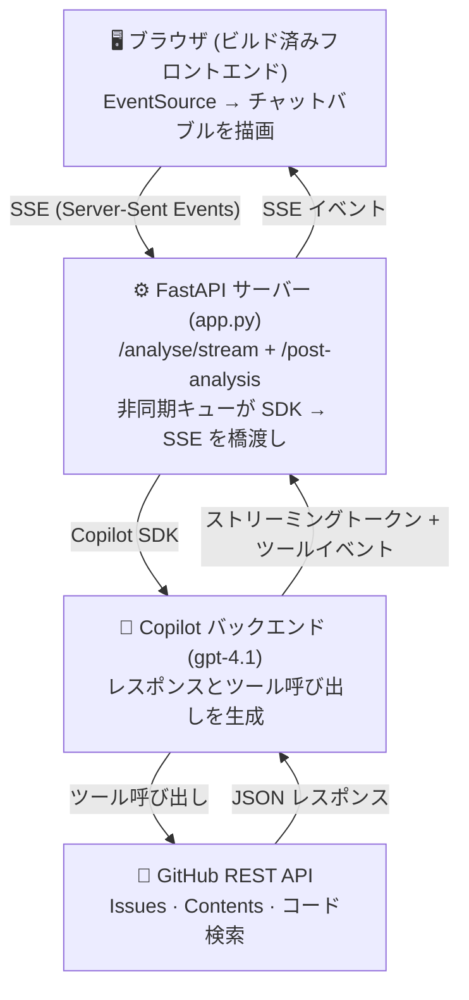

> 🌏 **Language / 言語**: [English (original)](README.md) · 日本語版 (このファイル)
>
> Original workshop by **Renee Noble** ([reneenoble/copilot-sdk-github-issue-analyser](https://github.com/reneenoble/copilot-sdk-github-issue-analyser)).
> 日本語版作成: **@ChibaYuki347**. MIT License.
>
> 用語の対訳は [`step-by-step/glossary.ja.md`](step-by-step/glossary.ja.md) を参照してください。

# 🐛 GitHub Issue Complexity Analyser

> **ライブ配信デモ**: GitHub Copilot SDK を使って AI 搭載の Issue トリアージツールを構築します

GitHub の Issue をコンテキストの中で解析するインテリジェントな Issue トリアージツールです。Issue の詳細を取得し、リポジトリ構造を探索し、ソースコードを読み取り、修正に適した開発者のスキルレベルを推奨する、構造化された複雑度評価を生成します。

GitHub Copilot SDK の機能を実演するために、**60 分のライブ配信**で構築されました。

> **📌 注**: これは一般公開向けに整えたプロジェクトの**クリーン版**です。計画と反復は[別のリポジトリ](https://github.com/reneenoble/gh-copilot-sdk-repo-analyser)で行われました。

> **📌 このリポの使い方** — GitHub Copilot SDK を学ぶための教材です。**自分のロール** に合わせて入口を選んでください:
> - **実際に手を動かして学ぶ場合**: [`step-by-step/build-guide.ja.md`](step-by-step/build-guide.ja.md) に従って [`app.py`](app.py) を穴埋めしながら構築します
> - **動いているところだけ見たい場合**: [`app_final.py`](app_final.py) を実行します (完成版)
> - **自分が発表する場合**: [`presenter-resources/`](presenter-resources/) からスタート ([`pre-stream-check.sh`](presenter-resources/pre-stream-check.sh) や [`script.ja.md`](presenter-resources/script.ja.md) を含む)

> 🇯🇵 **日本語デモを観ている方へ**: 同じ Renee Noble さんが作った **前身プロトタイプ** [`reneenoble/gh-copilot-sdk-repo-analyser`](https://github.com/reneenoble/gh-copilot-sdk-repo-analyser) (2026-01〜03) もありますが、ライブ配信で構築するのは**このリポジトリ**です。前身プロトタイプには `docs/architecture.png` という綺麗なアーキテクチャ図があり、SDK の使い方を別アングルから学びたい方は併せて参照してください。両者は同じ 4 ツール (`get_github_issue` 等) を使い、ロジックも近いです。

---

## 📚 学習リソース

### Copilot SDK を始める

| リソース | 説明 |
|----------|-------------|
| 📖 [Official SDK Documentation](https://github.com/github/copilot-sdk) | GitHub Copilot SDK のリポジトリとドキュメントです |
| 🎓 [Copilot SDK for Beginners Course](https://github.com/reneenoble/gh-copilot-sdk-repo-analyser) | *下書き* - SDK で AI エージェントを構築する方法を学ぶ実践コースです |
| 🛠️ [Copilot CLI Installation](https://docs.github.com/en/copilot/github-copilot-in-the-cli) | GitHub Copilot CLI をセットアップします (SDK に必須です) |

### Copilot SDK とは？

| エディタ内の Copilot | Copilot SDK |
|------------------------|-------------|
| VS Code、JetBrains などに組み込まれています | インストールして使う Python / JS / C# ライブラリです |
| 入力中にコードを提案します | あなたのアプリケーションが他のライブラリと同じように呼び出します |
| 画面上で結果を見ます | あなたのコードが結果を受け取り、何をするかを決めます |
| 開発者向けのツールです | アプリケーションの構成要素です |

**SDK を使うと、Copilot を自分のアプリケーションに組み込めます。** 何ができるかは自分で定義します。制御権はあなたのコードが持ちます。

**3 つの構成要素:**
1. **Client (クライアント)** - Copilot バックエンドに接続します (データベース接続のようなものです)
2. **Session (セッション)** - モデル、ツール、指示を設定する会話スレッドです
3. **Tools (ツール)** - 実行中にモデルが呼び出せる、あなたが書く通常の関数です

---

## ✨ 機能

| 機能 | CLI | Web アプリ |
|---------|-----|---------|
| URL または owner/repo/number による Issue 解析 | ✅ | ✅ |
| リアルタイムのストリーミング出力 | ✅ (ターミナル) | ✅ (SSE チャット UI) |
| ツール呼び出しの可視化 (どのファイル / API を問い合わせているか) | ✅ | ✅ |
| 構造化された Markdown 評価 | ✅ | ✅ (描画済み) |
| 連携用の REST API | - | ✅ |
| 解析結果を GitHub に書き戻す | ✅ | ✅ |

### 実演している Copilot SDK の概念

- **`CopilotClient`** - セッション作成とライフサイクル管理
- **`@define_tool`** - Pydantic パラメータスキーマを使ったカスタムツール定義
- **エージェント型のツール呼び出し** - Copilot がコンテキストを集めるために自律的に Python 関数を呼び出します
- **ストリーミングイベント処理** - `assistant.message`、`tool.call`、`session.idle` イベントのリアルタイム処理
- **マルチターンのツールループ** - エージェントは最終評価を出す前に複数ラウンドのツール呼び出しを行います

---

## 🏗️ アーキテクチャ



---

## 🚀 クイックスタート

### オプション 1: GitHub Codespaces (配信用に推奨)

最も簡単な始め方です。Dev Container ですべて事前設定されています。

1. **Code** → **Codespaces** → **Create codespace on ja** をクリックします
2. 求められたら、あなたの **GitHub パーソナルアクセストークン** を入力します (Codespace が自動で尋ねます)
3. セットアップが完了するまで待ちます。Python、依存関係、Copilot SDK はすべて自動でインストールされます
4. これで準備完了です！

### オプション 2: ローカル Dev Container

ローカルで、完全に分離された Codespaces のような体験を得たい場合です:

1. [Docker Desktop](https://www.docker.com/products/docker-desktop) をインストールします
2. VS Code に [Dev Containers](https://marketplace.visualstudio.com/items?itemName=ms-vscode-remote.remote-containers) 拡張機能をインストールします
3. VS Code でこのフォルダを開き、"Reopen in Container" (左下) をクリックします
4. VS Code は `docker-compose.yml` からコンテナをビルドし、自動的に次を行います:
   - `GITHUB_TOKEN` を含む `.env` ファイルを読み込みます
   - Python と依存関係をインストールします
   - GitHub CLI 拡張機能をセットアップします
5. これで準備完了です！

<details>
<summary><b>Dev Containers は初めてですか？</b> クリックして展開してください。</summary>

Dev Containers を使うと、ローカルマシンであるかのように Docker コンテナの中で開発できます。すべてのツール、依存関係、環境変数は分離され、再現可能です。

- **[Dev Containers Documentation](https://containers.dev/)** — 公式仕様とガイドです
- **[VS Code Remote Development](https://code.visualstudio.com/docs/remote/remote-overview)** — VS Code での使い方です
- **利点**: チーム全体で一貫した環境になり、「自分のマシンでは動く」問題を避けられ、オンボーディングも簡単です

このプロジェクトでは、Docker の内部を理解する必要はありません。単に「必要なものがすべて事前インストールされたサンドボックス環境の中の VS Code」だと考えてください。

</details>

### オプション 3: ローカル Python (コンテナなし)

コンテナ化せずに手早くローカルセットアップしたい場合です:

前提条件:
- **Python 3.10+**
- **[uv](https://docs.astral.sh/uv/)** (Python パッケージマネージャー)
- **GitHub Token** — API アクセスと Copilot SDK 認証に必要です

#### セットアップ

```bash
# リポジトリを clone します
git clone https://github.com/ChibaYuki347/copilot-sdk-github-issue-analyser.git
cd copilot-sdk-github-issue-analyser
git checkout ja

# GitHub トークンを含む .env ファイルを作成します
cp .env.example .env
# 次に .env を編集してトークンを追加します:
#   GITHUB_TOKEN=ghp_your_token_here

# 依存関係をインストールします
uv sync

# あるいは、シェルでトークンを export します
export GITHUB_TOKEN=ghp_your_token_here
```

### GitHub Token を取得する

3 つすべての方法で GitHub パーソナルアクセストークンが必要です。正しい権限で作成してください:

1. **github.com** → 右上のプロフィール画像 → **Settings** に移動します
2. 左側のサイドバーを下にスクロールして **Developer settings** → **Personal access tokens** → **きめ細かいトークン (Fine-grained tokens)** を開きます
3. **Generate new token** をクリックします
   - 名前: `copilot-sdk-stream` (または似た名前)
   - 有効期限: 7 日 (デモには十分です)
   - Repository access: **All repositories**
   - Permissions:
     - **Issues**: Read and Write
     - **Contents**: Read
4. **Generate token** をクリックしてコピーします
5. `.env` に追加します: `GITHUB_TOKEN=ghp_...` (または上の例のように export します)

### 使い方 (ターミナルから)

```bash
# SDK をテストします (フェーズ 2a: 最も単純な呼び出し)
python app.py hello

# ストリーミングをテストします (フェーズ 2b)
python app.py hello-stream

# URL で Issue を解析します
python app.py https://github.com/reneenoble/demo_project_with_issues/issues/3

# owner/repo/number で解析します
python app.py reneenoble demo_project_with_issues 3

# 日本語モードで Issue を解析します (app_final.py 側でのみ有効)
LANG=ja APP_LANG=ja python app_final.py https://github.com/VOICEVOX/voicevox/issues/2723

# Web UI を起動します (UI 上で "Post to GitHub" ボタンから書き戻し)
python app.py serve

# 日本語モードで Web UI を起動します (app_final.py 側)
LANG=ja APP_LANG=ja python app_final.py serve
```

> ⚠️ **CLI からの `post` サブコマンドは廃止されました** (upstream cd352ac)。書き戻しは Web UI の `Post to GitHub` ボタン (Human-in-the-loop) のみです。

---

### ▶️ VS Code から実行する (Run & Debug)

`app.py` (配信中に構築するコード) と `app_final.py` (完成版) のどちらも、ターミナルコマンドを覚えなくても VS Code の **Run and Debug** ビュー (⇧⌘D / Ctrl+Shift+D) から起動できます。本リポには [`.vscode/launch.json`](.vscode/launch.json) が同梱されているので、ドロップダウンから 1 つ選ぶだけで動きます:

| 起動設定 | 実行するもの | ポート | 使い分け |
|---|---|---|---|
| **Run Webapp Server** | `app.py serve` | `http://localhost:8000` | ライブ配信で**あなたが構築している**コード |
| **Run Webapp Server (final)** | `app_final.py serve` | `http://localhost:8001` | 完成版のリファレンス実装 |

> 💡 ポートを `8000` と `8001` に分けてあるので、**同時起動してもぶつかりません**。ライブ配信中に「自分のコード」と「完成版」を並べて見比べたい場面で便利です。

---

## 📂 プロジェクト構造

```
copilot-sdk-github-issue-analyser/
├── app.py                       # ⭐ ライブ配信で構築する穴埋めスキャフォールド (CLI + API + ツール)
├── app_final.py                 # ⭐ 完成版 (i18n も実装済み、APP_LANG=ja で日本語化)
├── extras_usage.py              # 任意の token usage ロガー (SHOW_USAGE=1 で有効化)
├── .vscode/
│   └── launch.json              # ⭐ "Run Webapp Server" / "Run Webapp Server (final)" の 2 設定
├── src/
│   ├── hello_world.py           # 最小の SDK 例 (ここから始めます！)
│   └── static/                  # ビルド済み Web フロントエンド (HTML/CSS/JS、Post to GitHub ボタンを含む)
├── step-by-step/
│   ├── build-guide.md           # フェーズごとのビルド計画 (英語版)
│   ├── build-guide.ja.md        # ⭐ フェーズごとのビルド計画 (日本語版・これに沿って進めます！)
│   └── glossary.ja.md           # ⭐ 日本語版 用語集 (翻訳の統一基準)
├── presenter-resources/         # ⭐ 発表者専用資料
│   ├── LIVESTREAM_PREP.md
│   ├── pre-stream-check.sh
│   ├── script.md / script.ja.md
│   ├── demo-issue-candidates.md # ⭐ 日本語版で使う Issue 候補 (VOICEVOX 等)
│   └── AI_Genius_Copilot_SDK_Ep3_EN.pdf
├── docs/
│   ├── RAI.md / RAI.ja.md       # 責任ある AI (RAI) のメモ
│   ├── SYNCING-UPSTREAM.ja.md   # ⭐ upstream 同期手順
│   └── architecture.png         # アーキテクチャ図
├── pyproject.toml               # Python 依存関係
├── AGENTS.md / AGENTS.ja.md     # Copilot 用のエージェント指示
└── README.md / README.ja.md     # 英語版 / 日本語版
```

> **💡 主要ファイル**: ライブ配信で**実際にコードを書き足す**のは [`app.py`](app.py)、**ガイド** として並走させるのは [`step-by-step/build-guide.ja.md`](step-by-step/build-guide.ja.md)、**i18n 実装** や日本語デモを動かすときに使うのは [`app_final.py`](app_final.py) です。

---

## 🎬 ライブ配信ビルド計画

このツールはライブ配信で **6 つのフェーズ** に分けて構築され、日本語版では次の **75 分構成** で進めます:

| フェーズ | 時間 | 構築したもの |
|-------|------|---------------|
| 1 | 0:00–0:06 | インポート + イントロ |
| 2a | 0:06–0:10 | `send_and_wait` を使った Hello World |
| 2b | 0:10–0:16 | イベントによるストリーミング |
| 3 | 0:16–0:31 | カスタムツール (`@define_tool`) |
| 4 | 0:31–0:41 | システムプロンプト + CLI アナライザー |
| 5 | 0:41–0:53 | FastAPI + Server-Sent Events |
| 6a | 0:53–0:56 | GitHub への書き戻し |
| 6b | 0:56–1:00 | セーフティフック (説明のみ) |
| Demo 2 (日本語 issue) | 1:00–1:05 | 日本語で書かれた issue を解析し、言語バイアスを実演 |

**まとめ**: 1:05–1:10 · **Q&A**: 1:10–1:15

コード付きの完全なフェーズ別ガイドは [`step-by-step/build-guide.md`](step-by-step/build-guide.md) を参照してください。

---

## 🎥 ライブ配信発表者向けセットアップ

このライブ配信を発表する場合は、**[`presenter-resources/`](presenter-resources/) フォルダ**を参照してください。以下を含む、発表者向けの全資料があります:
- **[`LIVESTREAM_PREP.md`](presenter-resources/LIVESTREAM_PREP.md)** — 完全なセットアップチェックリストとタイムライン
- **[`pre-stream-check.sh`](presenter-resources/pre-stream-check.sh)** — 自動化された環境検証スクリプト
- **[`AI_Genius_Copilot_SDK_Ep3_EN.pdf`](presenter-resources/AI_Genius_Copilot_SDK_Ep3_EN.pdf)** — 英語版プレゼンテーションデッキ (upstream の既存 PDF)
- **[`script.md`](presenter-resources/script.md)** — 詳細な 60 分版トーキングポイントとデモスクリプト

### 配信前のクイックスタート (30 分準備)

```bash
# 1. 新しい GitHub トークンを作成します (7 日で期限切れ)
#    移動先: https://github.com/settings/tokens?type=beta
#    Permissions: Issues (read/write), Contents (read)

# 2. .env ファイルにトークンを追加します
cp .env.example .env
# .env を編集してトークンを貼り付けます

# 3. 配信前チェックを実行します
bash presenter-resources/pre-stream-check.sh

# 4. 完全なセットアップとタイムライン: presenter-resources/LIVESTREAM_PREP.md を参照します
```

### 配信用の画面レイアウト

視聴者に次が見えるように画面を配置します:
1. **VS Code** (エディタ) — 左側で `app.py` を開きます
2. **Terminal** (出力) — 下部でライブ実行を見せます
3. **ブラウザー** (任意) — 右側でフェーズ 5 のデモ用に `http://localhost:8000` を開きます
4. **スライドデッキ (PDF)** — `presenter-resources/AI_Genius_Copilot_SDK_Ep3_EN.pdf` (画面外または第 2 モニター)

### 準備しておく主要デモ

| フェーズ | デモ | 期待される出力 |
|-------|------|---|
| 2a | `python app.py hello` | SDK についての 2 文の回答 |
| 2b | `python app.py hello-stream` | 同じ回答がトークンごとにストリーミングされます |
| 4 | `python app.py <issue_url>` | ツール呼び出しが表示された完全な解析 |
| 5 | `http://localhost:8000` を開く → Issue URL を貼り付ける → ブラウザーでストリームを見る | ツール呼び出しがアニメーション表示されるチャット UI |
| 6 | GitHub 上の Issue を確認します | 新しいコメントが投稿され、難易度ラベルが追加されます |

### トラブルシューティング

- **"GITHUB_TOKEN not found"** → `.env` ファイルまたは `export GITHUB_TOKEN=...` を確認します
- **"Rate limit exceeded"** → トークンが読み取られていません。`GITHUB_TOKEN` が設定されていることを確認します
- **"Model not available"** → Copilot アクセスがあることを確認し、`copilot --version` で確認します
- **ブラウザーが SSE に接続できません** → `localhost` の代わりに `http://127.0.0.1:8000` を試します

---

## 🔗 リンク

- 📖 **[Copilot SDK Documentation](https://github.com/github/copilot-sdk)**
- 🎓 **[Copilot SDK for Beginners Course](https://github.com/reneenoble/gh-copilot-sdk-repo-analyser)** *(下書き)*
- 🛠️ **[Copilot CLI Setup Guide](https://docs.github.com/en/copilot/github-copilot-in-the-cli)**
- 📋 **[Copilot Plans & Pricing](https://github.com/features/copilot/plans)** (無料枠も含みます！)
- **日本語版 ja ブランチ**: https://github.com/ChibaYuki347/copilot-sdk-github-issue-analyser/tree/ja

---

## ⚖️ 責任ある AI に関するメモ

詳細は [docs/RAI.md](docs/RAI.md) を参照してください。要点は次のとおりです:

- **人間の判断の代替ではありません** - この評価はトリアージの議論を始めるための出発点です
- **スキルレベルのラベルは文脈依存です** - 「ジュニア」と「シニア」は特定のコードベースへの習熟度を指します
- **個人データは処理しません** - 公開されている GitHub の Issue データとリポジトリ内容だけを読み取ります
- **完全な透明性** - すべてのツール呼び出しが見えるため、ユーザーはエージェントが何を調べたかを正確に確認できます

---

## 📄 ライセンス

MIT - 詳細は [LICENSE](LICENSE) を参照してください。
